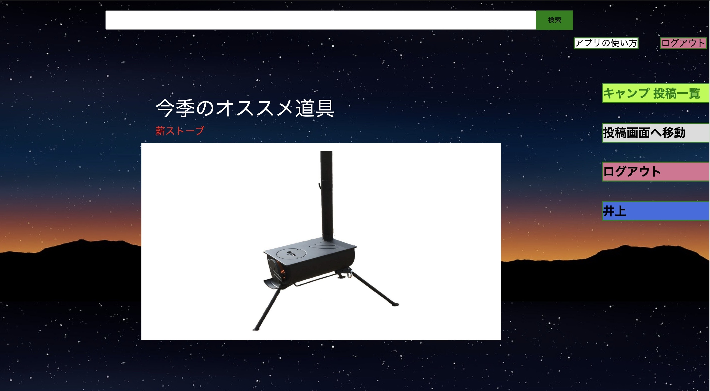
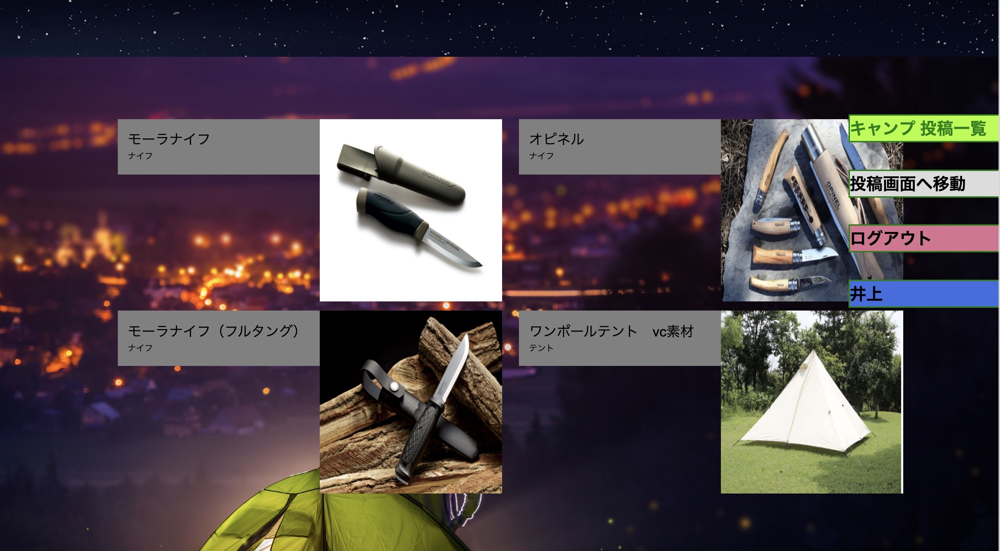
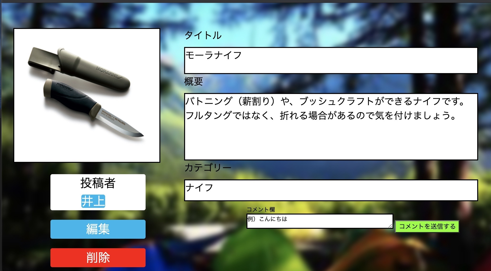
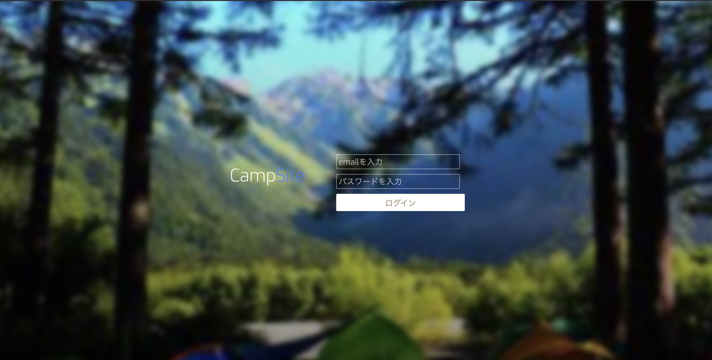
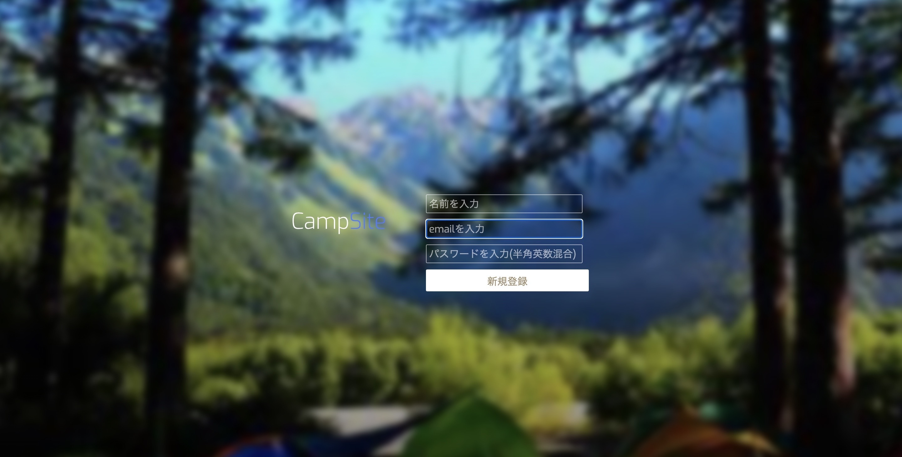
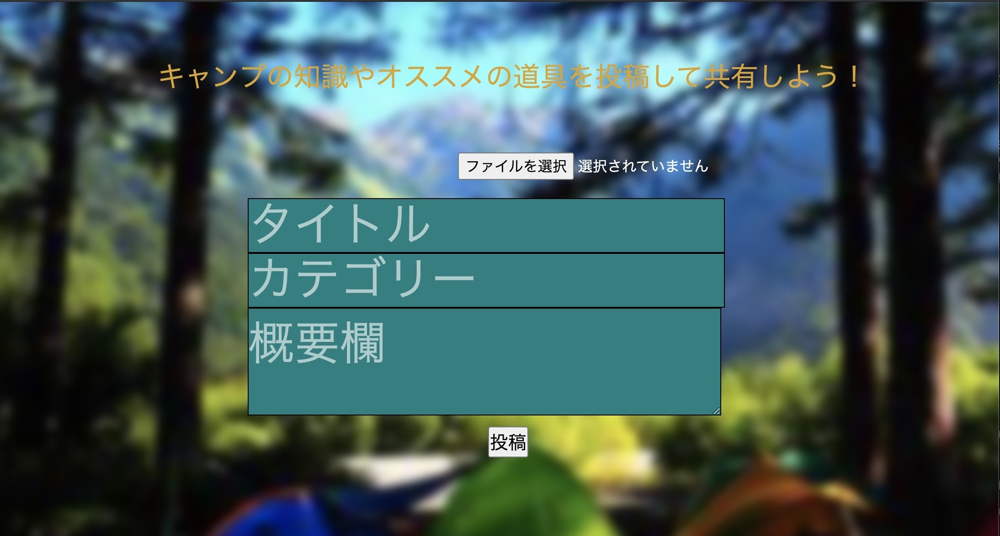
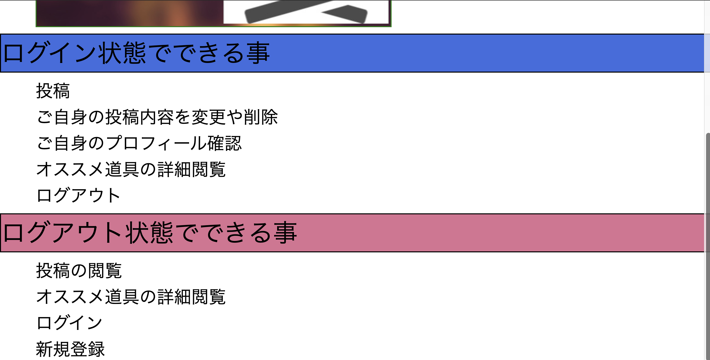
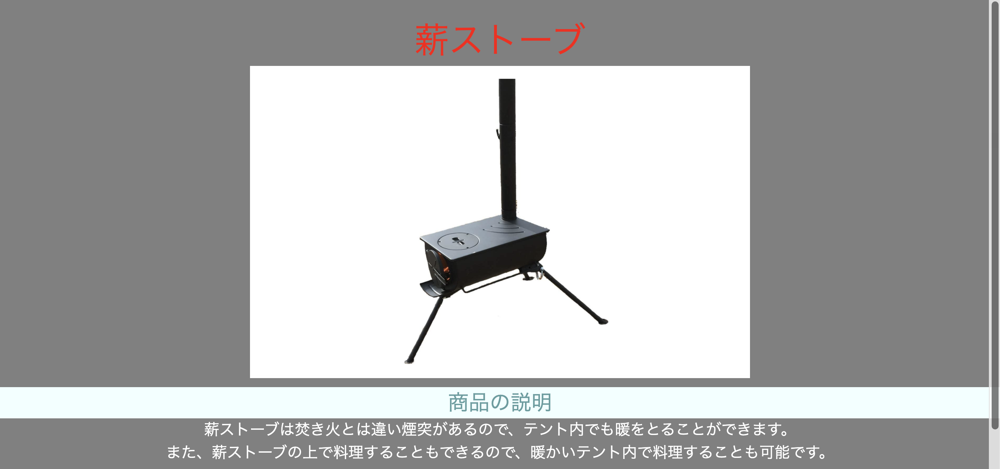
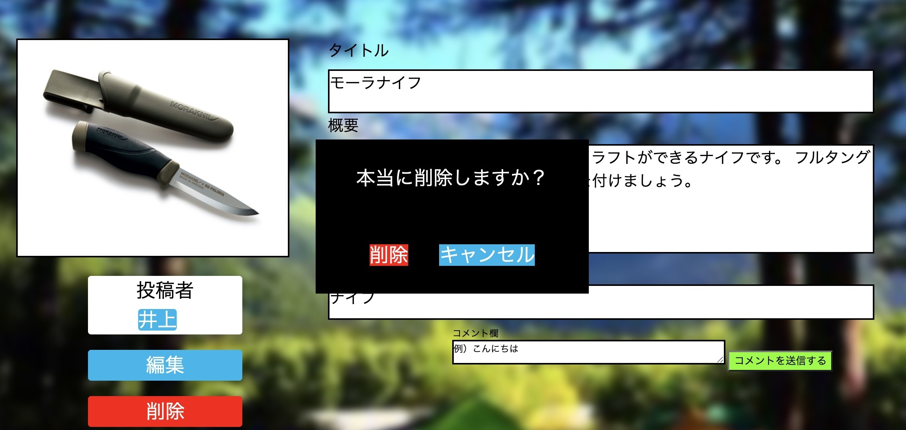

## アプリ名

- camp--site(キャンプサイト)

## 概要

- キャンプ初心者でもキャンプではどのような道具が必要なのか、何をすれば良いのかなど
  必要な知識を得られたり、キャンプに関する様々な情報を共有できるアプリです。
  
## 本番環境

## 制作背景（意図）

- 僕がキャンプを始めたばかりの頃、どんな道具があるのか、何をすればいいのか全く分からず
  何をどう調べたらいいのか分からなかったので、このようなアプリがあったら便利だなと思ったからです。
- そして最近はキャンプが流行っていて友達の間でもキャンプに興味はあるけど何が必要なのか、何をすればいいのか分からないという僕と同じような悩みを持っている人がいて、そのような悩みを解決したかったのでこのアプリを作ろうと思いました。

## DEMO

### トップ画面

### 投稿一覧画面

### 投稿詳細画面

### ログイン画面

### 新規登録画面

### 新規投稿画面

### アプリの使い方画面

### オススメ道具画面

## 工夫したポイント

- アプリの使い方がわかりやすいようにアプリの使い方画面を実装しました。
- 常に画面遷移できるように画面の右にボタンを配置しました。
- 削除ボタンを誤って押して投稿が消されないようにHTML,CSSを用いてポップアップを表示するようにしました。

## 使用技術(開発環境)
### バックエンド
- Ruby, Ruby on Rails

### フロントエンド
- HTML,CSS

### データベース
- MySQL

### ソース管理
- GitHub, GitHubDesktop

### エディタ
- VSCode

## 今後実装したい機能

- 検索機能
- js を用いたお気に入り機能
- コメント機能

## users テーブル

| Column             | Type   | Options      |
| ------------------ | ------ | ------------ |
| name               | string | null: false  |
| email              | string | unique: true |
| encrypted_password | string | null: false  |

### Association

- has_many :camps
- has_many :comments

## camps テーブル

| Column   | Type    | Options                       |
| -------- | ------- | ----------------------------- |
| title    | string  | null: false                   |
| text     | text    | null: false                   |
| category | string  | null: false                   |
| user_id  | integer | null: false foreign_key: true |

### Association

- belongs_to :user
- has_many :comments

## comments テーブル

| Column  | Type    | Options                       |
| ------- | ------- | ----------------------------- |
| camp_id | integer | null: false foreign_key: true |
| user_id | integer | null: false foreign_key: true |
| text    | text    | null: false                   |

### Association

- belongs_to :user
- belongs_to :camp
