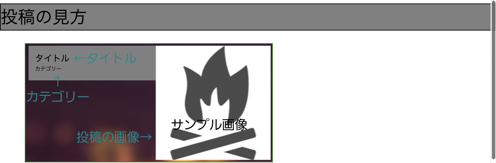
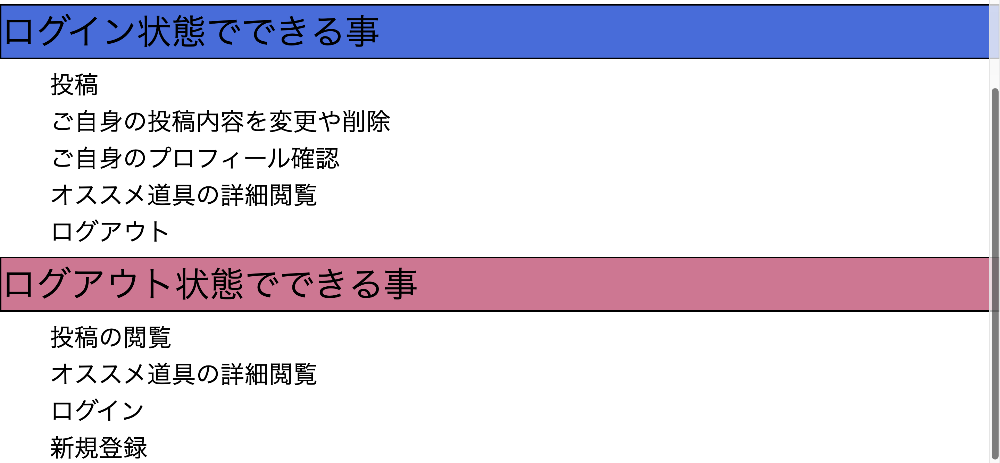

## アプリ名

- camp--site(キャンプサイト)
- 名前の由来は、キャンプサイト（キャンプをする場所）とサイト（WEB上）をかけてキャンプサイトという名前にしました。

## 概要

- キャンプ初心者でもキャンプではどのような道具が必要なのか、何をすれば良いのかなど
  必要な知識を得られたり、キャンプに関する様々な情報を共有できるアプリです。
  
## 本番環境

## 制作背景（意図）

- 僕がキャンプを始めたばかりの頃、どんな道具があるのか、何をすればいいのか全く分からず
  何をどう調べたらいいのか分からなかったので、このようなアプリがあったら便利だなと思ったからです。
- そして最近はキャンプが流行っていて友達の間でもキャンプに興味はあるけど何が必要なのか、何をすればいいのか分からないという僕と同じような悩みを持っている人がいて、そのような悩みを解決したかったのでこのアプリを作ろうと思いました。

## DEMO

### トップ画面

- 少しでもキャンプに興味を持ってもらって、こういう道具もあると気づいてもらうために、一番最初に目の入るところにオススメ道具を紹介しました。
  画像をクリックするとオススメ道具画面に遷移します。
- また、アプリの使い方がパッと見で分からない場合もあるので、アプリの使い方の説明画面を実装し、右上にボタンを配置しました。
- 右サイドの四つのボタンはスクロールしても固定するように設定してあるのでいつでも画面遷移できます。

### 投稿一覧画面

- 画面を縮めるとタイトルやカテゴリーがはみ出してしまう不具合を見つけたので、要素内でスクロールできるようにしました。
- 投稿の画像をクリックすると投稿詳細画面に遷移できます。

### 投稿詳細画面

- この画面では投稿の詳細を見ることができます。コメント機能も今後実装予定です。
- 工夫点は、削除ボタンを押すとすぐ削除してしまっていてとても不便だったので、cssを用いてポップアップを表示し、誤削除を防いでいます。
- 編集ボタンを押すと編集画面へ遷移します。
- 投稿者のみ編集、削除できます。
- 投稿者ボタンを押すと、投稿者の投稿一覧プロフィールに遷移します。

### ログイン画面

- この画面ではメールアドレスとパスワードを入力し、ログインすることができます。

### 新規登録画面

- この画面では名前、メールアドレス、パスワードを入力し、新規登録をしてログイン状態にできます。

### 新規投稿画面

- この画面では、画像、タイトル、カテゴリ、概要欄を入力し、投稿することができます。
- ログイン状態でないとこの画面に遷移することができません。

### アプリの使い方画面

- トップ画面のアプリの使い方ボタンをクリックするとこの画面に遷移できます。

### オススメ道具画面

- トップ画面のオススメ道具の画像をクリックするとこの画面に遷移できます。

## 工夫したポイント

- アプリの使い方がわかりやすいようにアプリの使い方画面を実装しました。
- 常に画面遷移できるように画面の右にボタンを配置しました。
- 削除ボタンを誤って押して投稿が消されないようにHTML,CSSを用いてポップアップを表示するようにしました。

## 使用技術(開発環境)
### バックエンド
- Ruby, Ruby on Rails

### フロントエンド
- HTML,CSS

### データベース
- MySQL

### ソース管理
- GitHub, GitHubDesktop

### エディタ
- VSCode

## 今後実装したい機能

- 検索機能
- js を用いたお気に入り機能
- コメント機能

## users テーブル

| Column             | Type   | Options      |
| ------------------ | ------ | ------------ |
| name               | string | null: false  |
| email              | string | unique: true |
| encrypted_password | string | null: false  |

### Association

- has_many :camps
- has_many :comments

## camps テーブル

| Column   | Type    | Options                       |
| -------- | ------- | ----------------------------- |
| title    | string  | null: false                   |
| text     | text    | null: false                   |
| category | string  | null: false                   |
| user_id  | integer | null: false foreign_key: true |

### Association

- belongs_to :user
- has_many :comments

## comments テーブル

| Column  | Type    | Options                       |
| ------- | ------- | ----------------------------- |
| camp_id | integer | null: false foreign_key: true |
| user_id | integer | null: false foreign_key: true |
| text    | text    | null: false                   |

### Association

- belongs_to :user
- belongs_to :camp
